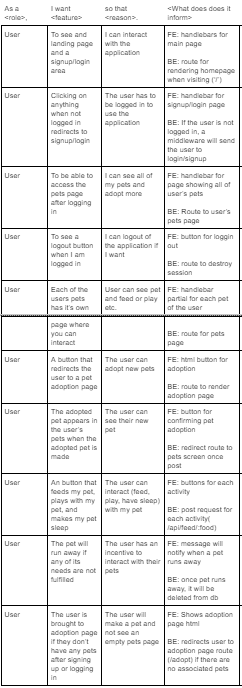
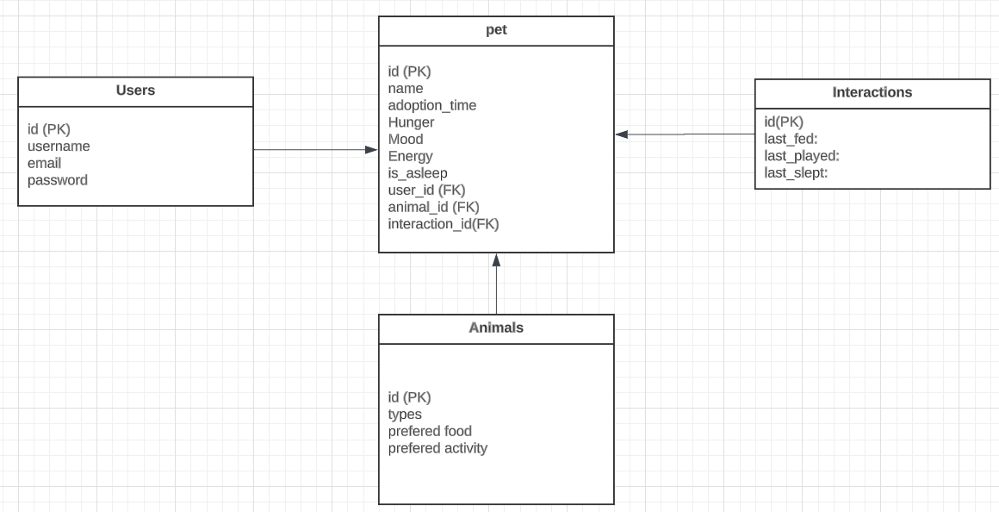
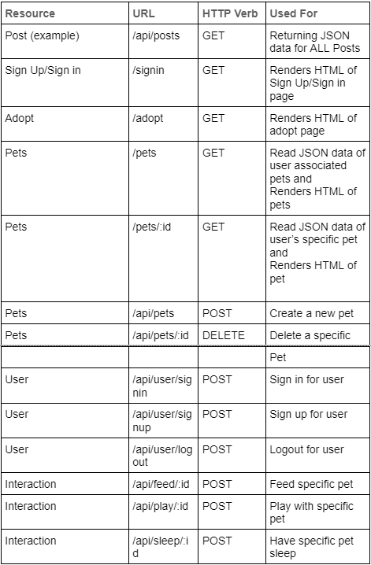

# Pixel Pets

## Table of Contents

* [Description](#description)
* [User Stories](#user-stories)
* [Models](#models)
* [RESTful Routes](#restful-routes)
* [Features](#features)
* [Usage](#usage)
* [Technologies Used](#technologies-used)
* [Authors](#authors)
* [Credits](#credits)
* [Learning Points](#learning-point)
* [Code Snippet](#code-snippet)
* [Interactjs](#interactjs)
* [License](#license)

## Description
Pixel Pets is an interactive web game that lets the user adopt virtaul pet and take care of them. Once they have adopted a pet, the user can then go to the pets page to interact with them. The user can feed their pet, play with their pet, and let their pet rest in order to satisfy their needs. If the does not have its needs fulfiled in within a certain amount of time, the pet will run away.

[Visit the deployed site](https://whispering-fortress-56629-59156f7e4e61.herokuapp.com/pets/1)


## User Stories


## Models


## RESTful Routes


## Features

* 8 different virtual pets that the user can take care of
* Pets tied to users' accounts
* Pets' stats in the form of bars
* Different food and tasks that coresspond to different animals
* Adopt as many pets as you want
* Pets run away if neglected

## Usage
* Login and sign-up page appears when the user first opens the site
* Adoption page that shows the user all of the available pets that can be adopted
* User's pets page shows all of the pets the user has
* The specific pets page allows user to interact with pet
* Drag food to feed your pet
* Click on activities to play with your pet


## Technologies Used
* HTML (Handlebars)
*	CSS (Bulma framework)
*	JavaScript
* Node
* NPM
* Express
* MySQL
* Sequelize ORM
* Interactjs
* Dayjs

## Authors:

### Ross Fahan
* [GitHub](https://github.com/RossFahan)
* [LinkedIn](https://www.linkedin.com/in/rossfahan/)
* [Portfolio](https://rossfahan.github.io/my-portfolio/)

### Ahkar Hein
* [GitHub](https://github.com/ahkar-hein)
* [LinkedIn](https://www.linkedin.com/in/ahkar-hein-9b4065100/)
* [Portfolio](https://ahkar-hein.github.io/Portfolio-website/)

### Timothy Su
* [GitHub](https://github.com/timothysu1)
* [LinkedIn](https://www.linkedin.com/in/timothysu1/)
* [Portfolio](https://timothysu1.github.io/portfolio-timothysu/)

## Credits:
* Game Sprites: https://emojipedia.org/google 
* Additional Font: https://fonts.google.com/specimen/Cherry+Bomb+One?query=cherry+bomb 
* Background Image: https://www.canva.com/
* Interactjs: https://interactjs.io/
* Dayjs: https://day.js.org/
* Bulma: https://bulma.io/documentation/overview/classes/

## Learning Point:
* Creating our own API's and performing Fetch requests
* Deploying Applications through Heroku
* Seeding a database provided by JawsDB

## Code Snippet
```js
router.post('/feed/:petId', async (req, res) => {
    try {
        const pet = await Pet.findByPk(req.params.petId, {
            include: [{ model: Interaction }],
        });
        if (!pet) {
            return res.status(404).json({ message: 'Pet not found.' });
        }
        pet.is_sleeping = false;
        const updatedPet = decrementStats(pet);

        updatedPet.hunger = Math.min(100, updatedPet.hunger + HUNGER_INCREMENT_WHEN_FED);
        updatedPet.interaction.last_fed = dayjs().toISOString();

        await updatedPet.save();

        const interaction = await Interaction.findByPk(pet.interaction.id);
        if (interaction) {
            interaction.last_fed = updatedPet.interaction.last_fed;
            await interaction.save();
        } else {
            console.log('Interaction not found.');
        }
        res.status(200).json(/* updatedPet,  */{ message: 'Pet fed successfully.' });
    } catch (err) {
        res.status(500).json(err);
    }
});
```
The post route for feeding a pet 

## Interactjs
We used Interactjs to give drag-and-drop functionality to the food items when feeding pets.


```js
const draggableButton = document.querySelectorAll('.draggable-button');

draggableButton.forEach((btn) => {
  interact(btn).draggable({
    listeners: {
      start(event) {
        event.interaction.startOffset = { x: 0, y: 0 };
      },
      move(event) {
        const { x, y } = event.interaction.startOffset;
        const dx = event.pageX - event.clientX0;
        const dy = event.pageY - event.clientY0;
        event.target.style.transform = `translate(${x + dx}px, ${y + dy}px)`;
      },
      end(event) {
        event.target.style.transform = 'translate(0px, 0px)';
      },
    },
  });
})

const dropZone = document.querySelector('.drop-zone');

interact(dropZone)
  .dropzone({
    ondrop: async function (event) {

      const droppedElement = event.relatedTarget;
      const id = dropZone.getAttribute('data-id')
      if (droppedElement.id == dropZone.id) {
        const response = await fetch(`/api/feed/${id}`, {
          method: 'POST',
          headers: {
            'Content-Type': 'application/json'
          }
        });
        if (response.ok) {
        } else {
          alert(response.statusText);
        }
      }
    },
  });
```
This code shows how Interactjs was incoporated to our application.
## License

Please refer to license in the repo.